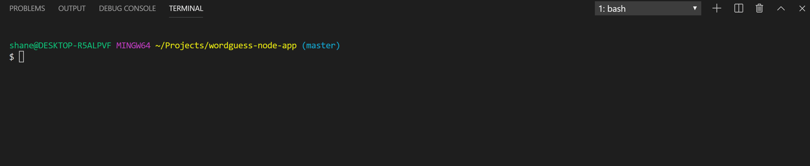

# wordguess-node-app
A guessing game using inquire and node

## Overview
This app was created in order to provide the user with a fun guessing game that selects from a library of words one word that the user must guess, letter by letter.

## Organization
This app is broken up into three distinct js files:
1. `index.js` our root filet that runs the game and imports Word.js

2. `Word.js` our constructor for creating the word and has methods for checking and displaying said word.  Imports Letter.js for each letter in the word.

3. `Letter.js`our constructor for creating a letter. Has methods that checks the letter held against a letter, and displays either the letter or a placeholder depending on whether the letterGuessed variable is true.

### How to run
The app may be run by typing node index.js,  after this the game will run, and the user will be prompted for letters in order to make guesses.

## Example Gifs:

-Playing the game

## Technologies
wordguess-node-app uses the following technologies:
1. Inquirer, asks the user for input
2. Colors, changes console.log output color
3. Figlet, changes console.log output to ascii art, makes it fun!

## Collaborators

**Shane Nelson!**